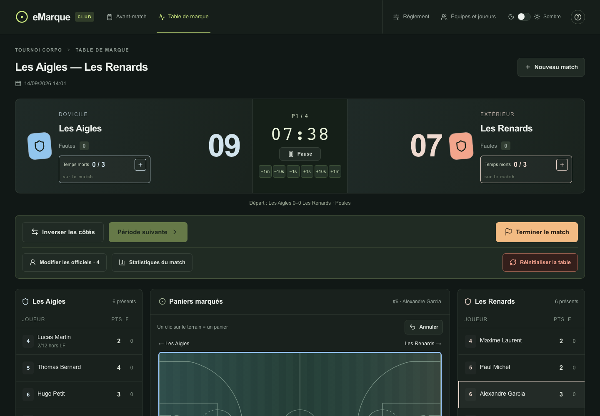
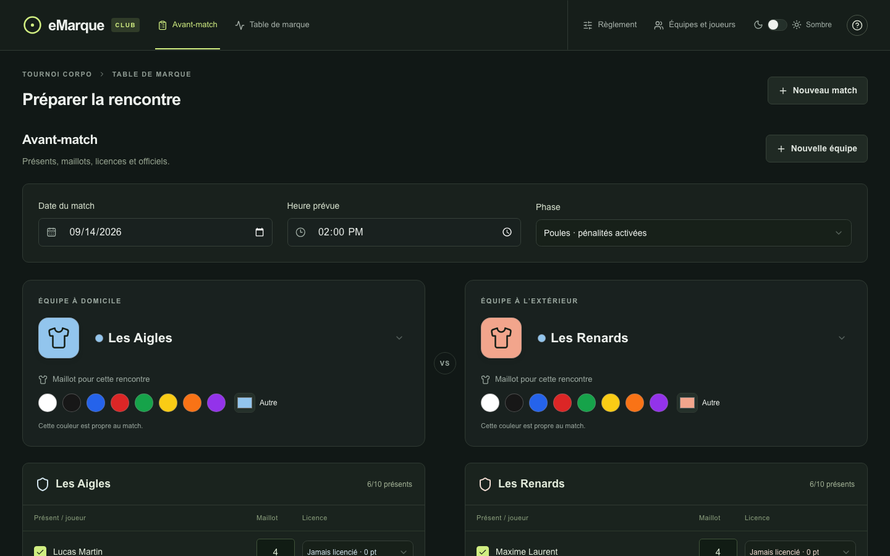
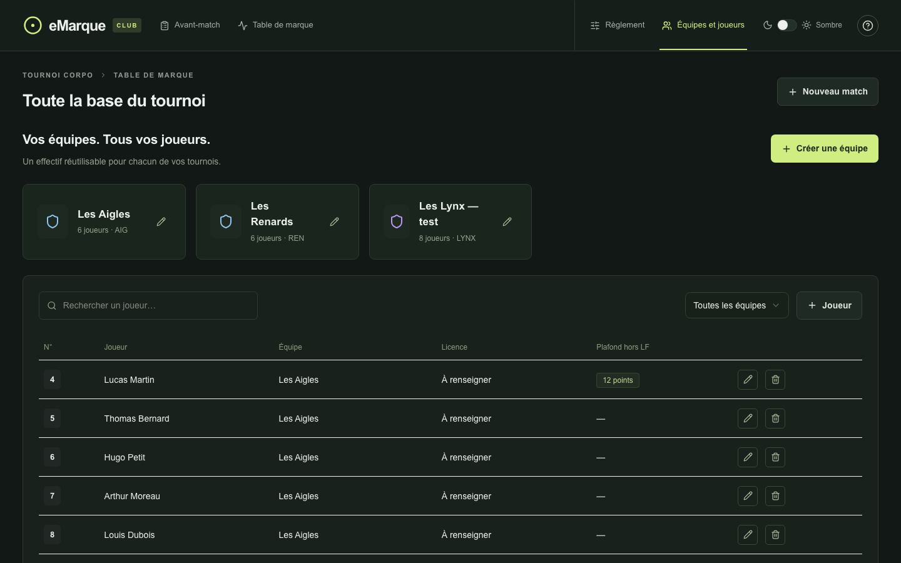
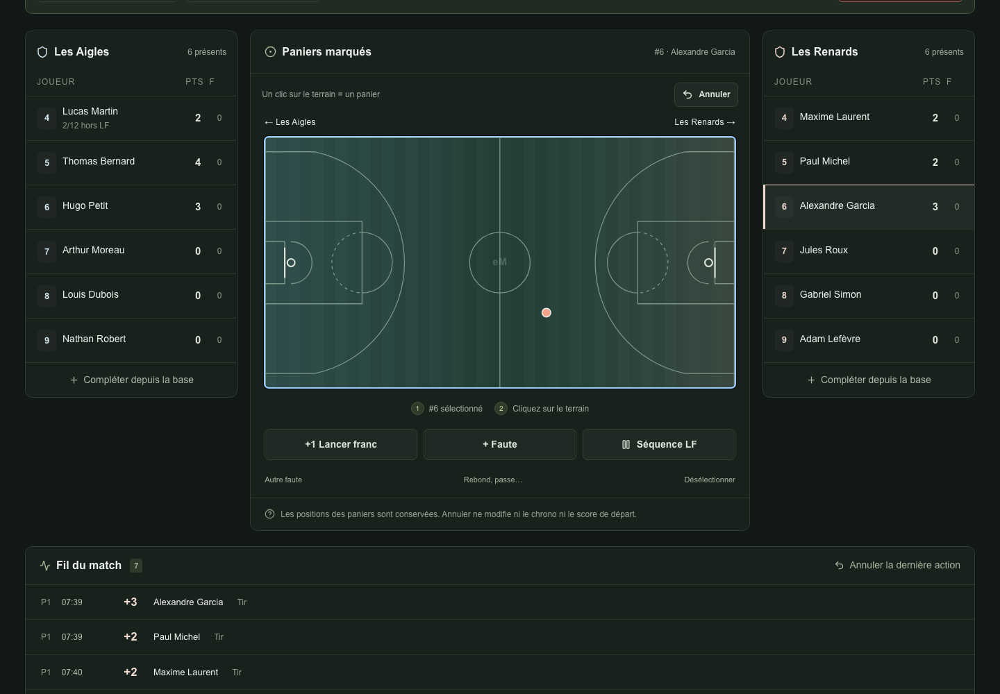
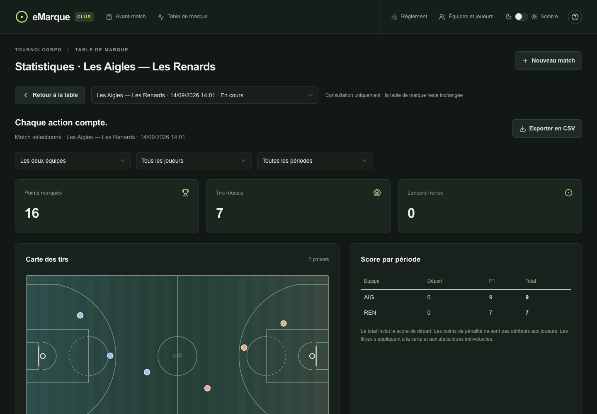

<p align="center">
  
</p>

<h1 align="center">eMarque Club</h1>

<h4 align="center">Table de marque pour les tournois internes et corpo · indépendante du logiciel officiel.</h4>

<p align="center">
  
  
  
  
  
</p>

<p align="center">
  <a href="#-à-quoi-ça-sert">À quoi ça sert</a> •
  <a href="#-fonctionnalités">Fonctionnalités</a> •
  <a href="#-sauvegarde">Sauvegarde</a> •
  <a href="#-installation">Installation</a> •
  <a href="#️-stack">Stack</a>
</p>

## Aperçu

<p align="center">
  
</p>

---

## 🏀 À quoi ça sert

eMarque Club sert de table de marque pour des tournois internes et corpo de basket : préparation de la rencontre, saisie du score en direct, chrono, fautes et temps morts, puis statistiques une fois le match terminé. Elle est volontairement indépendante du logiciel officiel de la fédération.

« Équipes et joueurs » contient toute la base du tournoi : couleurs d'équipes, maillots, licences et plafonds individuels. La base est réutilisable d'un match à l'autre ; les statistiques, elles, se consultent match par match depuis la table de marque.

---

## ✨ Fonctionnalités

### 📋 Avant-match

<p align="center">
  
</p>

Sélection des équipes, des présents, des renforts et des officiels avant chaque rencontre. Couleur de maillot choisie par match, deux arbitres proposés par défaut avec marqueur et chronométreur : chaque poste se cherche dans les joueurs ou se saisit à la volée. Une personne ne peut occuper deux postes ni jouer et officier sur la même feuille.

### 👥 Équipes et joueurs

<p align="center">
  
</p>

Une base de tournoi réutilisable : équipes, effectifs, licences et plafonds individuels. Les corrections de joueurs et d'identité d'équipe se répercutent automatiquement dans les matchs non terminés, sans jamais écraser les couleurs de maillot déjà choisies à l'avant-match.

### 🏀 Marquage en direct

<p align="center">
  
</p>

Sélectionner un joueur puis cliquer sur le terrain ajoute immédiatement un panier à 2 ou 3 points, avec la position du tir mémorisée pour les statistiques. Lancers francs et fautes personnelles sont directs. Le chrono se corrige par ±1&nbsp;s / ±10&nbsp;s / ±1&nbsp;min sans changer son état de marche, et « Annuler » revient sur la dernière action sans confirmation.

### 📊 Statistiques

<p align="center">
  
</p>

Carte des tirs, score par période, filtres par équipe / joueur / période et export CSV. Les statistiques des feuilles terminées restent accessibles depuis une table vide, sans réouverture possible du match.

---

## 💾 Sauvegarde

L'affichage est immédiat, la sauvegarde suit derrière : une file d'enregistrement regroupe les saisies rapides, sérialise les requêtes et conserve les annulations, avec des identifiants de mutation pour retenter une réponse perdue sans doublon.

- **D1** (Cloudflare) est la base durable.
- **`sessionStorage`** garde une copie temporaire des actions non confirmées dans l'onglet.
- Une panne ou un conflit conserve la copie locale et propose une exportation de secours.

> [!NOTE]
> Garder l'onglet ouvert jusqu'à confirmation d'enregistrement, et utiliser une seule table de saisie à la fois.

---

## 🚀 Installation

**Prérequis : Node.js ≥ 22.13.**

```bash
git clone https://github.com/antonin-lfv/eMarqueClub.git
cd eMarqueClub
npm run install:ci
npm run dev
```

L'application tourne sur [http://localhost:5173](http://localhost:5173). Les migrations D1 locales sont dans `drizzle/` et utilisent `.wrangler/state`.

### Tests et validation

```bash
npm test        # règles, prêts, conservation des matchs, synchronisation, chrono, file de sauvegarde
npm run typecheck
```

---

## 🛠️ Stack

| | |
|---|---|
| **Framework** | Next.js 16 · React 19 · TypeScript |
| **UI** | Tailwind CSS · Radix UI · shadcn |
| **Hébergement** | Cloudflare Workers |
| **Base de données** | Cloudflare D1 · Drizzle ORM |
| **Build / dev** | Vite · vinext · Wrangler |
